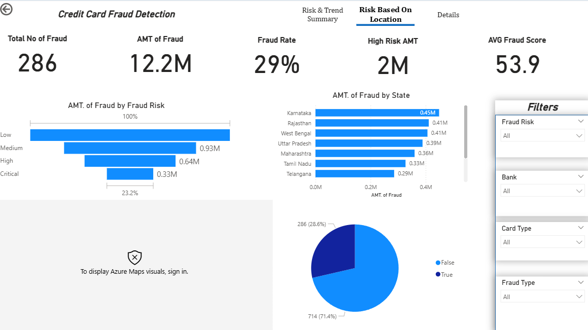
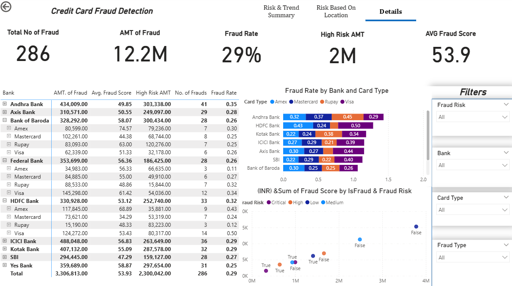

# Credit Card Fraud Risk Analysis – Power BI Dashboard

This project provides a comprehensive analysis of credit card fraud using Power BI.  
The dashboard identifies fraud patterns, highlights high-risk categories, and visualizes transaction trends across different locations, banks, and card types.

The goal is to support fraud analysts and financial institutions in detecting suspicious behaviors and minimizing financial losses.

---

## 📂 Project Files

| File | Description |
|------|-------------|
| `Credit_Fraud_Finals.pbix` | Final Power BI dashboard with all visuals, DAX measures, and transformations |
| `Credit Card Fraud Risk Analysis.csv` | Original raw credit card fraud dataset |
| `Credit_Card_Fraud_Risk_Analysis_Cleaned.csv` | Cleaned dataset after Power Query transformations |
| `/screenshots` | Folder containing dashboard screenshots |

---

## 📸 Dashboard Screenshots

### **Risk & Trend Summary Page**

### **Risk Based on Location**

### **Details Page**

---

## 🔍 Insights Summary

### 🧾 1. Overall Fraud Statistics
- **Total Number of Frauds:** 34 / 286  
- **Total Fraud Amount:** 354K / 12.2M  
- **Average Fraud Score:** 51–54  
- **Fraud Rate:** 29% – 34%  

### 🕵️ 2. Fraud Type Breakdown
Most common fraud types:
- Identity Theft  
- Account Takeover  
- Card Not Present  
- Card Skimming  
- Phishing  

### 💰 3. High-Loss Fraud Types
- Identity Theft → 94K  
- Card Not Present → 92K  
- Account Takeover → 81K  

These categories represent the majority of fraud losses.

### 🌍 4. Location-Based Risk Analysis
Top states by fraud amount:
- Karnataka  
- Rajasthan  
- West Bengal  
- Uttar Pradesh  
- Maharashtra  

### 🏦 5. Bank-Level Fraud Analysis (Details Page)
Industries/banks with highest exposure:
- ICICI Bank  
- Federal Bank  
- Andhra Bank  
- Axis Bank  
- HDFC Bank  

Heatmaps and scatter plots show fraud distribution by **card type**, **fraud risk**, and **fraud score**.

---

## 🛠️ Data Preparation (Power Query)
Cleaning steps included:
- Removing duplicates  
- Handling missing values  
- Standardizing column names  
- Encoding categorical fields  
- Creating calculated columns
